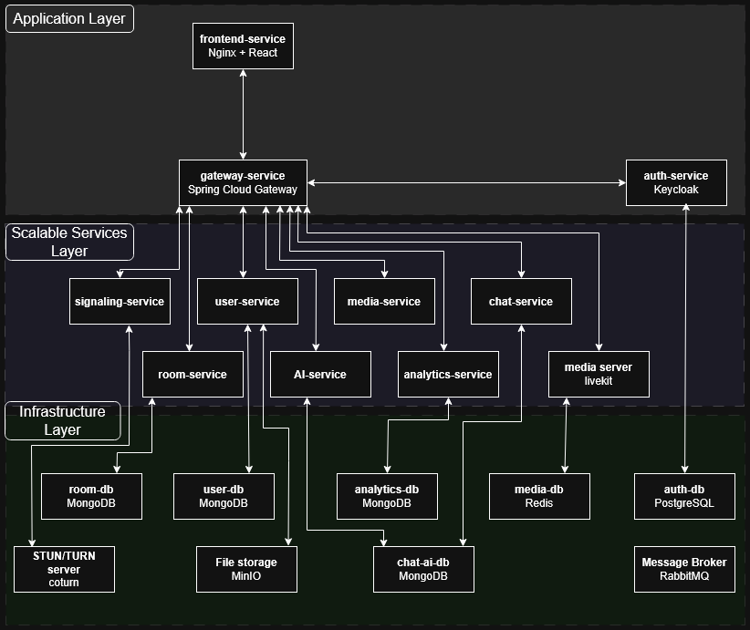

# Voice Messenger

Voice Messenger is a scalable real-time communication system. It combines the features of classic text messengers, such as chat, history, and message statuses, with voice and video transmission capabilities. The system is built on a distributed microservices architecture, ensuring flexibility and performance necessary for real-time applications.

## My Role
In this project, I was primarily responsible for the backend development and system architecture. The frontend implementation was handled separately.

## Key Features
* User authentication using Keycloak with OAuth2 and OpenID Connect (OIDC) standards.
* Profile management and a friend system for initiating private conversations.
* Hierarchical server structure allowing users to create or join servers with text and voice channels.
* Real-time text messaging utilizing STOMP over WebSockets and RabbitMQ.
* Direct 1-on-1 audio and video calls using a Peer-to-Peer (P2P) model with a Coturn server for NAT traversal.
* Group voice channels utilizing a Selective Forwarding Unit (SFU) architecture with a LiveKit server to optimize bandwidth.
* Automated background content moderation via an AI microservice that detects toxic content and hate speech.
* Network telemetry and Quality of Service (QoS) monitoring for WebRTC connections.

## Tech Stack
### Backend
* **Language:** Java 21
* **Framework:** Spring Boot 3.4.1
* **Architecture:** Spring Cloud 2024.0.0
* **API Gateway:** Spring Cloud Gateway
* **Security:** Spring Security 6

### Frontend
* **Framework:** React 19
* **Language:** TypeScript 5.9
* **Build Tool:** Vite
* **WebRTC Client:** LiveKit Client SDK
* **WebSocket Client:** @stomp/stompjs

> **Repository Note:** While this repository contains the complete full-stack codebase, GitHub language statistics have been intentionally configured via `.gitattributes` to highlight **Java**. This reflects my primary role as the backend developer and the core architectural focus of this project.

### Infrastructure & Data Storage
* **Databases:** MongoDB and PostgreSQL.
* **Cache:** Redis for real-time session management.
* **Object Storage:** MinIO for static files like avatars.
* **Message Broker:** RabbitMQ for asynchronous microservice communication.
* **Containerization:** Docker and Docker Compose.
* **Media Server:** LiveKit Server (SFU).
* **STUN/TURN Server:** Coturn for NAT traversal.

## Deployment & Infrastructure
The system has been successfully deployed to a live environment utilizing a hybrid networking approach. Due to the lack of a public IPv4 address in the local hosting environment, a VPS was utilized to expose the services.
* **FRP (Fast Reverse Proxy):** Establishes a secure tunnel between the local Docker environment and the public VPS. This exposes TCP/HTTP services and routes the necessary UDP packets required for WebRTC (LiveKit and Coturn).
* **Caddy Server:** Acts as the edge server and reverse proxy on the VPS. It handles automatic SSL/TLS termination via Let's Encrypt, securing API traffic with HTTPS and WebSocket traffic with WSS.
* **Dynamic DNS (DDNS):** Integrated to map a custom domain name to the VPS IP address, ensuring stable access for users.

## Future Roadmap
Currently, the system is orchestrated using Docker Compose. The upcoming plan is to deprecate Spring Cloud components in favor of implementing Kubernetes for container orchestration. This transition will introduce advanced horizontal scalability, better resource management, and higher availability for the microservices.

## Full Documentation
For a deep dive into the system architecture and design decisions, the comprehensive project documentation (in Polish) is available here:
[Voice Messenger Technical Documentation](docs/voice-messenger-documentation-pl.pdf)